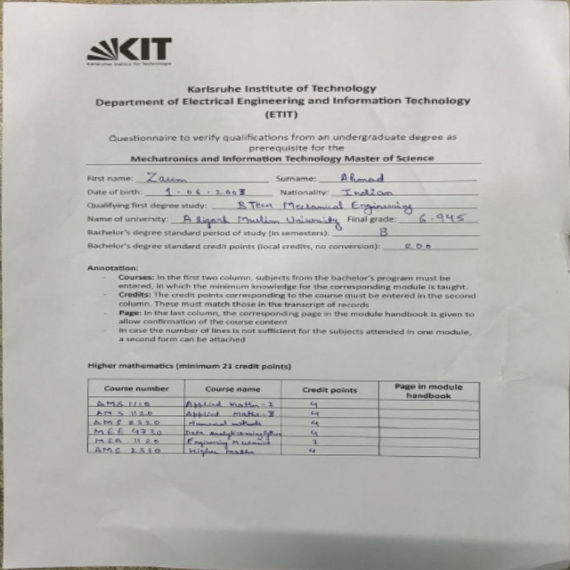

# 📄 Document Scanner using OpenCV

A simple document scanner built with **Python** and **OpenCV** that automatically detects a document in an image, applies a perspective transformation, and generates a top-down scanned version.

## 📌 Features

- Detects the largest rectangular document in an image
- Converts the image to grayscale
- Applies Gaussian Blur for noise reduction
- Uses Canny Edge Detection to find document edges
- Performs dilation and erosion to strengthen edges
- Detects contours and identifies the document boundary
- Applies Perspective Transform to obtain a flat, scanned document
- Saves the scanned output as an image

---

## 🛠️ Technologies Used

- Python 3
- OpenCV (`cv2`)
- NumPy

---

## 📂 Project Structure

```
Document-Scanner/
│
├── 7.jpeg              # Input image
├── output.jpeg         # Generated scanned image
├── scanner.py          # Main Python script
├── requirements.txt
└── README.md
```

---

## ⚙️ Installation

### Clone the repository

```bash
git clone https://github.com/Zaeem-Irtiza/Document-Scanner-opencv.git
cd document-scanner-opencv
```

### Install dependencies

```bash
pip install -r requirements.txt
```

or

```bash
pip install opencv-python numpy
```

---

## ▶️ Usage

1. Place the document image in the project folder.
2. Rename it to:

```
7.jpeg
```

or modify this line in the code:

```python
img_orig = cv2.imread("./input/7.jpeg")
```

3. Run the script:

```bash
python Document_Scanner.py
```

4. The program will:

- Detect the document
- Draw the detected contour
- Warp the document into a flat view
- Save the result as:

```
output.jpeg

```

---

## 🧠 How It Works

### 1. Image Preprocessing

The image undergoes several preprocessing steps:

- Convert to grayscale
- Gaussian Blur
- Canny Edge Detection
- Dilation
- Erosion

These operations enhance the document edges for accurate contour detection.

---

### 2. Contour Detection

The algorithm:

- Finds all external contours
- Sorts them by area
- Selects the largest contour with exactly four corners

This assumes the document is the largest rectangular object in the image.

---

### 3. Perspective Transformation

The four detected corner points are reordered and used to compute a perspective transformation matrix.

OpenCV then warps the original image into a top-down view of the document.

---

## 📷 Output

**Original Image**

- Detects the document boundary

**Scanned Image**

- Perspective corrected
- Flattened document
- Ready for further processing or OCR



Output Video
[Output Video](./output/output_vid.mp4)

---

## 📈 Future Improvements

- Automatic corner ordering
- Adaptive thresholding for cleaner scans
- Shadow removal
- Automatic cropping
- Support for multiple documents
- OCR integration using Tesseract
- Batch image processing
- PDF export

---

## 📚 Learning Concepts

This project demonstrates:

- Computer Vision
- Image Processing
- Edge Detection
- Contour Detection
- Polygon Approximation
- Perspective Transformation
- Geometric Image Warping

---

## 🤝 Contributing

Contributions, suggestions, and improvements are welcome.

1. Fork the repository
2. Create a feature branch
3. Commit your changes
4. Open a Pull Request

---

## 📄 License

This project is licensed under the MIT License.

---

## ⭐ If you found this project useful, consider giving it a star!